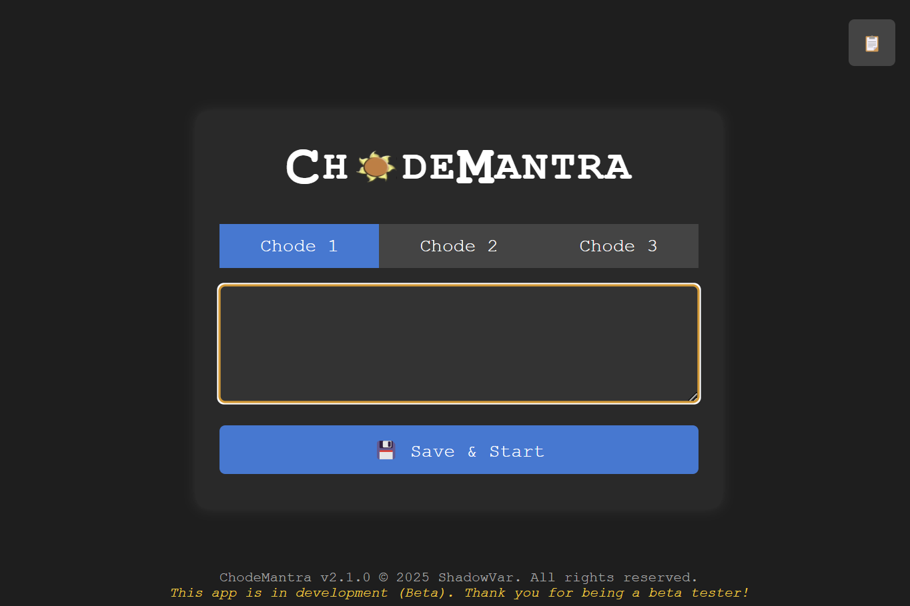

# ChodeMantra

**ChodeMantra** is a desktop application designed to automate code snippet typing with advanced human-like behavior, simulating natural typing patterns for educational purposes. Built with **Electron** for a cross-platform interface and **Python** for typing automation, it enables users to save and trigger up to three code snippets using global keyboard shortcuts. This tool is ideal for studying automation techniques in environments like browser-based coding platforms (e.g., CodeTantra, confirmed functional as of June 29, 2025—verify compatibility at [www.codetantra.com](https://www.codetantra.com)).

> **⚠️ Disclaimer**: ChodeMantra is intended for **educational use only** to explore typing automation. Unauthorized use in proctored exams or restricted environments may violate academic integrity policies or terms of service. Always use responsibly and ethically.

---

## ✨ Features

- **Advanced Human-Like Typing**  
  Simulates typing at ~80 WPM with biometric keystroke delays, typos, corrections, and behavioral pauses to mimic natural human typing.

- **Global Shortcuts**  
  Trigger snippets with `Ctrl+Alt+Q`, `Ctrl+Alt+W`, or `Ctrl+Alt+E`. Terminate typing with `F9`. Playful error messages are typed for incorrect shortcuts (`Ctrl+Alt+Z/X/C/V/B/N`).

- **Snippet Management**  
  Store and manage up to three code snippets via an intuitive Electron-based UI.

- **Indentation Handling**  
  Automatically removes leading/trailing whitespace from snippets to prevent conflicts with coding editors’ auto-indentation. Manual indentation fixes may be required (future updates will address this).

- **Logging**  
  Tracks actions in `logs/snippet_log.txt` for easy debugging and usage monitoring.

- **Browser-Based Proctoring Compatibility**  
  Optimized for browser-based platforms (e.g., CodeTantra), where hardware keyboard detection is less likely compared to standalone proctoring apps.

### ✨ Human Behavior Simulation Features (Advanced)

ChodeMantra simulates realistic human typing behavior at high speeds (~80 WPM) with advanced biometric and behavioral features for a natural typing experience:

🔹 **Typing Realism Features**

- **Biometric Keystroke Delays**  
  Character delays vary based on:  
  - **Key Type**: Punctuation (e.g., `.`, `;`), uppercase letters, and spaces have context-specific delays.  
  - **Word Position**: First letters of words are slightly slower to mimic human initiation.  
  - **Random Fatigue/Hesitation**: Periodic delays every ~20–30 characters simulate natural pauses.  
  - **Rhythmic Bursts**: Confident typing bursts occur every ~20–30 characters, reflecting human typing flow.

- **Accidental Typo + Correction**  
  Randomly introduces a typo (~1/20 characters), followed by a backspace and correction, mimicking human error recovery.

- **Mistimed Spacebar Simulation**  
  Occasionally types a space before a word ends, then backspaces and resumes, simulating accidental spacebar presses.

- **Long Word Hesitation**  
  Brief pause before typing rare or long words (>10 characters), reflecting natural human hesitation.

- **Key-Pair Delay Optimization**  
  Common bigrams (e.g., "th", "er", "in", "qu") are typed slightly faster to match human efficiency with frequent letter pairs.

- **"Thinking" Pauses**  
  Random pauses between words or lines (every 6–12 words) simulate a person pausing to think or plan.

---

## 🛠️ Installation

### Prerequisites
- **Node.js** (v20.17.0 recommended): [Download](https://nodejs.org/)
- **Python** (3.12+): [Download](https://www.python.org/downloads/)
- **Git**: [Install](https://git-scm.com/)

### Steps
1. **Clone the Repository**  
   ```bash
   git clone https://github.com/ShadowVar/ChodeMantra.git
   cd ChodeMantra
   ```

2. **Install Node.js Dependencies**  
   ```bash
   npm install
   ```

3. **Install Python Dependencies**  
   ```bash
   pip install -r requirements.txt
   ```

4. **Run the Application**  
   ```bash
   npm start
   ```

5. **Optional: Build Executable**  
   Create a standalone Windows installer:  
   ```bash
   npm run dist
   ```  
   Find the installer in the `dist` folder.

---

## 🚀 Usage in Browser-Based Proctored Tests

ChodeMantra is tailored for browser-based coding platforms like CodeTantra (functional as of June 29, 2025—verify at [www.codetantra.com](https://www.codetantra.com)). Below is a step-by-step guide for using it to study automation techniques in such environments.

> **⚠️ Note**: This workflow is for educational exploration. Using automation in proctored exams may violate rules and lead to consequences. Always adhere to ethical guidelines.

### Workflow
1. **Open the Test**  
   Launch the proctored test in a supported browser (e.g., Chrome, Edge, Brave).

2. **Enable Browser Utilities**  
   Install Chrome extensions to bypass restrictions:  
   - **Enable Right Click & Copy**: [Link](https://chromewebstore.google.com/detail/ofgdcdohlhjfdhbnfkikfeakhpojhpgm?utm_source=item-share-cb)  
   - **Always Active Window**: [Link](https://chromewebstore.google.com/detail/always-active-window-alwa/ehllkhjndgnlokhomdlhgbineffifcbj)  
   Ensure extensions are active during the test.

3. **Run ChodeMantra**  
   Start ChodeMantra via `npm start` or the executable before the test. Keep it running in the background.

4. **Extract Test Questions**  
   Use a text extractor like **Microsoft PowerToys Text Extractor** ([Download](https://learn.microsoft.com/en-us/windows/powertoys/)) to capture question text if copying is disabled.

5. **Generate Code Solutions**  
   Paste the question into an AI LLM (e.g., ChatGPT Desktop App, [Download](https://openai.com/chatgpt/download)) to generate code solutions.

6. **Prepare Snippets in ChodeMantra**  
   - Copy the generated code.  
   - Paste into ChodeMantra’s tabs (Chode 1, Chode 2, Chode 3).  
   - Click **💾 Save & Start** or press `Ctrl+Alt+S` to register shortcuts.  
   - **Note**: Whitespace is automatically trimmed to avoid auto-indentation issues. Manual fixes may be needed post-typing.

7. **Type Snippets**  
   - Switch to the test’s code editor within 3 seconds.  
   - Use shortcuts:  
     - `Ctrl+Alt+Q`: Types Chode 1 snippet.  
     - `Ctrl+Alt+W`: Types Chode 2 snippet.  
     - `Ctrl+Alt+E`: Types Chode 3 snippet.  
     - `F9`: Stops typing immediately.  
   - Code is typed with advanced human-like behavior.

8. **Work Efficiently**  
   Minimize window switching to avoid proctoring flags or auto-submission. Practice in a mock environment for speed.

9. **Verify Output**  
   - Check typed code for indentation errors and fix manually if needed.  
   - Review `logs/snippet_log.txt` for usage details.

### Why Browser-Based Tests?
- Browser-based platforms are less likely to detect non-hardware keyboard input.  
- Standalone proctoring apps may terminate background processes, affecting ChodeMantra.  
- Always test compatibility with your specific platform.

---

## 📂 Project Structure

- `index.html`: Main UI template with a sleek, minimal design.  
- `index.js`: Electron backend for global shortcuts and Python integration.  
- `rendered.js`: Frontend logic for tab switching and snippet saving.  
- `styles.css`: Styling with a `Courier New` monospace theme.  
- `type_snippet.py`: Python script for advanced human-like typing automation.  
- `package.json`: Node.js dependencies and build configuration.  
- `requirements.txt`: Python dependencies (e.g., `pyautogui`).  
- `sun.ico` / `sun.png`: Application icon for branding.  
- `snippet_temp.txt`: Temporary storage for snippets before typing.  
- `logs/snippet_log.txt`: Log file for tracking actions.

---

## 🛠️ Tech Stack

- **Electron** (v34.0.2): Cross-platform desktop framework.  
- **Node.js** (v20.17.0): Backend runtime for app logic.  
- **Python** (PyAutoGUI): Automates typing with advanced human-like behavior.  
- **HTML/CSS**: Clean, user-friendly interface.

---

## 📚 References

- [Electron Documentation](https://www.electronjs.org/docs)  
- [PyAutoGUI Documentation](https://pyautogui.readthedocs.io/)  
- [CodeTantra Platform](https://www.codetantra.com/)  
- [Microsoft PowerToys](https://learn.microsoft.com/en-us/windows/powertoys/)

---

## 🔄 Changelog

### v2.1.0 (June 29, 2025)
- **Faster Typing Speed**: Increased typing speed to ~80 WPM (from ~65 WPM) with refined `random.triangular` distribution for more realistic human typing.
- **Improved Termination**: Replaced `F12` with `F9` for global termination to avoid conflicts with browser dev tools. Added sentinel file (`autotyper_stop.txt`) and Windows `taskkill` fallbacks for reliable stopping.
- **Single-Pass Typing**: Fixed issue where snippets were typed repeatedly; now types each snippet once and exits.
- **Enhanced Logging**: Improved error logging in `type_snippet.py` and `index.js` for better debugging of typing and termination issues.

### v2.0.0
- Initial release with human-like typing, global shortcuts, and browser-based proctoring compatibility.

---

## 🤝 Contributing

Contributions are welcome! Potential enhancements include:  
- Auto-indentation fixes for typed code.  
- Additional shortcut customization.  
- Improved proctoring platform compatibility.  

Submit pull requests via [GitHub](https://github.com/ShadowVar/ChodeMantra).

---

## 📜 License

MIT License. © 2025 ShadowVar.

---

## 🆘 Support

For issues, create a [GitHub issue](https://github.com/ShadowVar/ChodeMantra/issues) or test ChodeMantra in a safe, educational environment. Happy coding, and may your automation adventures be seamless and bug-free! 😄

---

**ChodeMantra v2.1.0** | Built with 💻 and ☕ by ShadowVar
